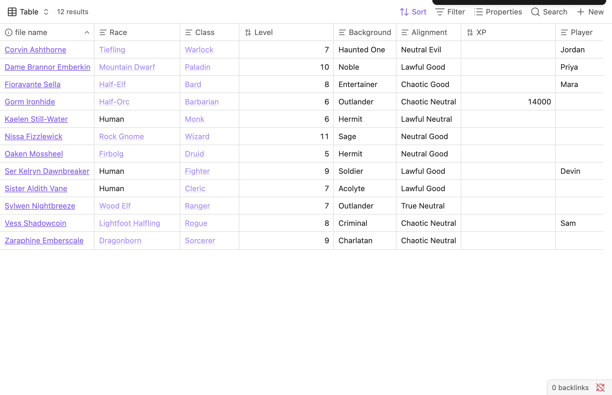
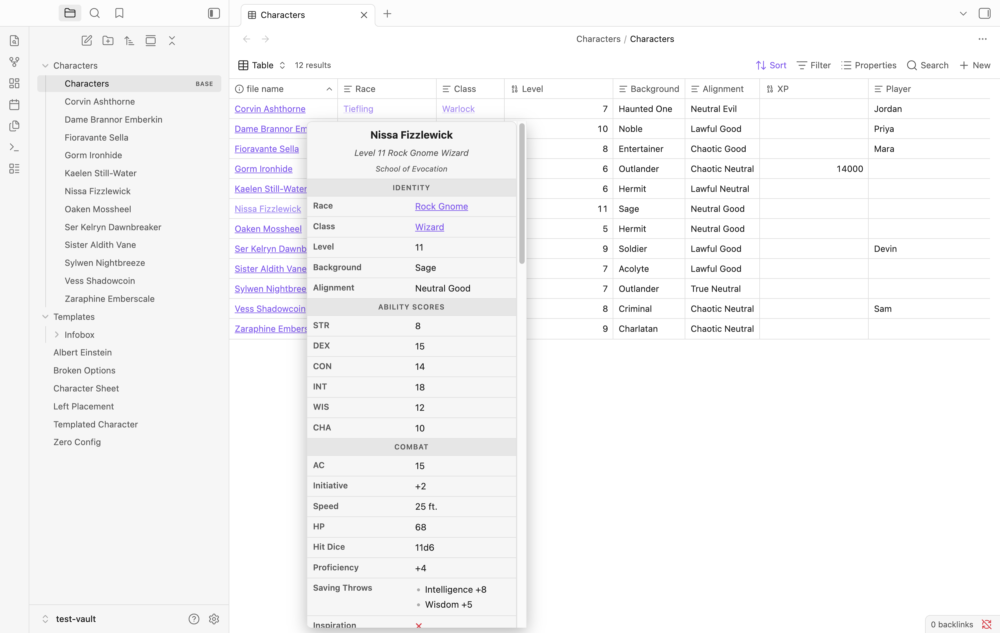
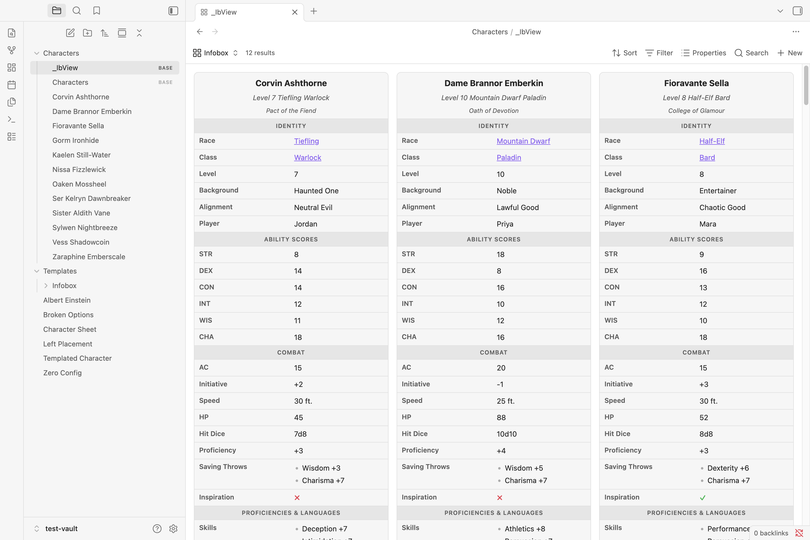

# Bases

Advanced Infobox connects to Obsidian [Bases](https://help.obsidian.md/bases) three ways: it
**generates** a Base from a folder of infobox notes, **previews** a note's infobox on hover
inside any Base, and adds an **Infobox view** that renders every entry as its full box. All
three need the core Bases plugin (Obsidian 1.9+) and quietly do nothing without it, so the
rest of the plugin still works on older Obsidian.

## Create a Base from a folder

A folder of notes that share a template — a party of characters, a bestiary, a gazetteer of
places — is exactly the shape a Base wants. The **Create base from folder** command builds
one for you:

1. Open any note in the target folder.
2. Run **Create base from folder** from the command palette.
3. A `<Folder>.base` is created next to the notes and opened.

The command scans the folder, detects the [template](templates.md) its notes share (the most
common value of the template property, e.g. `infobox: dnd`), and projects that template onto
two views:

- A **table** view (a traditional list) — `file.name` plus the template's first section as
  columns, sorted by name.
- A **cards** view (a gallery) — the note title as each card's heading, a few headline
  fields, and a cover image when your notes have one.

It also writes:

- a **filter** scoping the Base to the folder and the template
  (`file.inFolder("Characters")` **and** `note.infobox == "dnd"`), and
- **column names** for the properties. Bases shows a column's raw property id (`armor_class`)
  unless a display name is set, so the command supplies them from the template's labels —
  `armor_class` → "AC", `strength` → "STR", and so on.

The result is an ordinary `.base` file you fully own: reorder columns, add views, change the
filter, delete it and regenerate — the command just gives you a running start.

> The generated file is **presentation only**. It reads your frontmatter; it never writes to
> your notes.

## Preview an infobox on hover

Turn on **Infobox on hover in Bases** ([setting](settings.md#bases), on by default) and
resting the pointer on a note's link inside a Base pops its full infobox in a floating card:

It's the same box you'd see in the note — same template, same styling — because it reuses the
exact rendering pipeline. It even live-updates if you edit the note while the popover is open,
and a tall sheet scrolls inside the card.

This triggers wherever the Base renders a **link to a note**. In a table view that's the
file-name column, so hovering a row previews that row's note; a resolved `[[wikilink]]` field
previews its own target instead.

### Caveat: cards

The hover is **best-effort** — it reads the Base's rendered markup rather than any official
hook. Native Bases **cards do not expose a file link** in their DOM, so a card's own note
isn't hoverable and hover is effectively table-first. (The plugin deliberately does *not*
guess the note from a card's title text, which would show the wrong infobox on any mismatch.)
For a card-style gallery, use the [Infobox view](#the-infobox-view) below instead — a
first-class Bases view that renders each entry directly, with no such limitation.

## The Infobox view

Rather than hovering for one box at a time, you can _browse_ a whole Base as infoboxes. Turn
on **Infobox view in Bases** ([setting](settings.md#bases), **off by default**) and Bases
gains a new view type — **Infobox** — next to Table and Cards. Pick it from a Base's view
menu and every entry renders as its full infobox in a responsive gallery:

Because it's a first-class Bases view (registered through the plugin API, Obsidian 1.10+), it
has none of the hover feature's card limitation — it holds the query's entries directly and
renders each note's box with the same pipeline used everywhere else. Switching a generated
base to this view gives you an instant character gallery.

Registration happens when the plugin loads, so toggling the setting takes full effect after a
reload.

## See also

- [TTRPG character sheets](ttrpg-example.md#from-roster-to-base) — the roster → Base flow on a real 12-character party.
- [Templates](templates.md) — the template that shapes the generated columns and labels.
- [Settings](settings.md#bases) — the Bases toggles (hover preview and the Infobox view).
