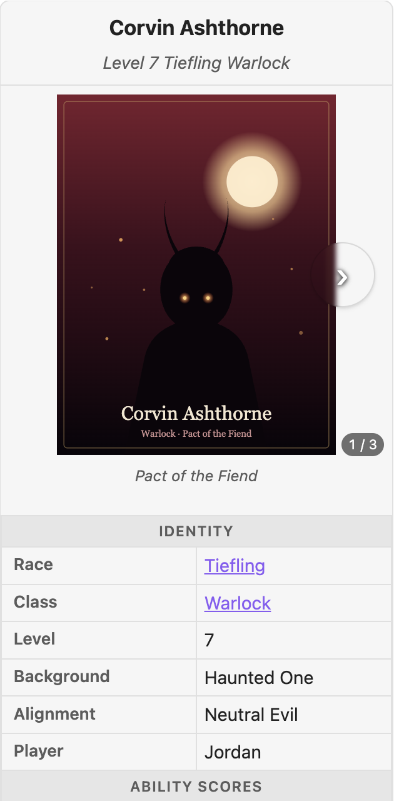
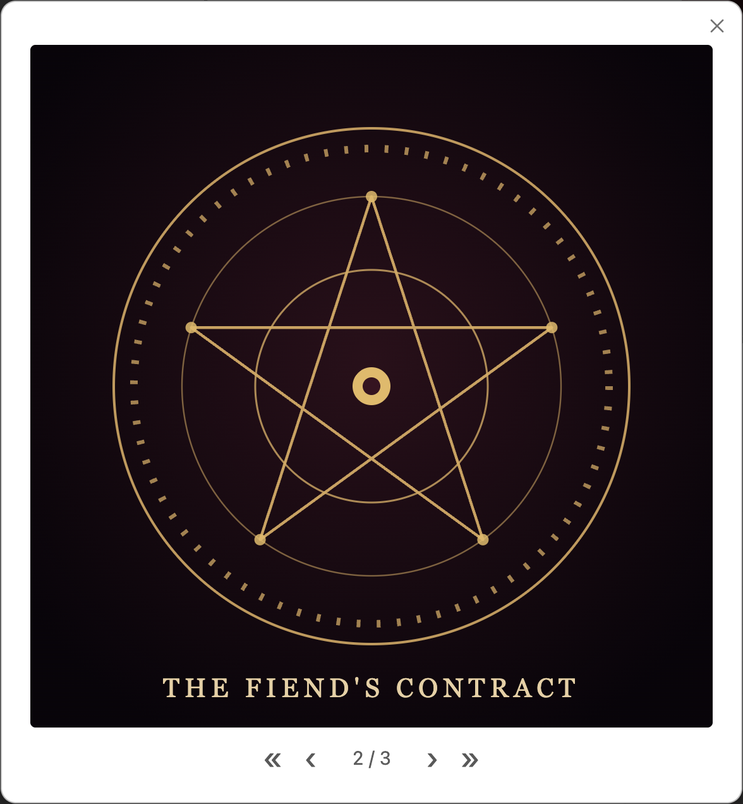
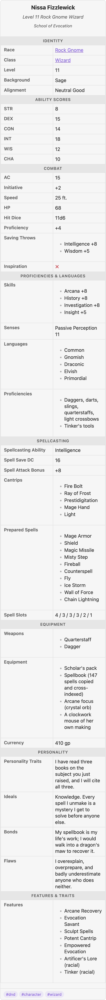

# Data model

The plugin has exactly one rule, and every design decision follows from it:

> **Data lives in flat frontmatter.** Presentation lives elsewhere — [settings](settings.md),
> [templates](templates.md), [block options](block-options.md), and CSS. Breaking any
> presentation config can never lose data.

Flat means no nested `infobox:` object to hand-maintain. Your properties stay editable in
Obsidian's Properties panel and visible to Dataview and Bases. The infobox is downstream of
the data, never the other way around.

## Everything is a property

Every frontmatter key becomes a **field** in the box, in file order, except:

- **Special keys** that feed the header instead of the field list.
- **Excluded keys** (see below).
- Keys with an **empty value** (`null`, `""`, or an empty list) — silently skipped.

### Special keys

These map to parts of the header, and never appear as ordinary fields. Each is
[remappable in settings](settings.md#special-keys) if your vault uses different names.

| Purpose | Default key |
| --- | --- |
| Title (falls back to the filename) | `title` |
| Subtitle under the title | `subtitle` |
| Image — one, or a list for a carousel (wikilink, vault path, or URL) | `image` |
| Caption under the image | `caption` |
| Tags row at the foot of the box | `tags` |
| [Template](templates.md) selector | `infobox` |

### Images and the carousel

`image` takes a single image **or a YAML list** of them:

```yaml
image:
  - "[[cover.png]]"
  - "[[in-profile.png]]"
  - "https://example.com/portrait.jpg"
```

- A single image (or a one-item list) renders just as before.
- Two or more turn the header into a **carousel**: hover for previous / next
  chevrons and a slide counter in the corner. Order follows the list.
- Clicking any image opens a **lightbox** — a full-size viewer with
  first / previous / next / last controls (also arrow keys, `Home` / `End`, and
  `Esc` to close).
- Tall or oversized images are capped at `--aib-image-max-height` (default
  `20em`) so they never stretch the card — [theme it](theming.md) to taste.



Clicking any image opens the lightbox — a full-size viewer on a dimmed backdrop:



A list is still flat frontmatter, so it stays the single source of truth: reorder,
add, or remove images from the note's properties and the box follows. (A
per-note [`image` block option](block-options.md) sets one image, not a list.)

## How values render

The plugin classifies each value by its type and renders it accordingly — you never
annotate types, it reads them from the YAML:

| Frontmatter value | Renders as |
| --- | --- |
| `class: "[[Wizard]]"` | Markdown — so **wikilinks and formatting are live and clickable** |
| `level: 11` | A number |
| `inspiration: true` | A checkbox: `✓ / ✗` or `Yes / No` ([setting](settings.md#field-display)) |
| `born: 1879-03-14` | A date, formatted with your Moment [date format](settings.md#field-display) |
| `weapons: [Rapier, Dagger]` | A list — bulleted, comma-separated, or chips ([setting](settings.md#field-display)) |
| A nested object | Inline code (this plugin exists to help you *avoid* these) |

The character sheets in the [TTRPG example](ttrpg-example.md) exercise every one of these:



*One card, many types: `Race`/`Class` are clickable links, ability scores are numbers, `Inspiration` is a `✗` checkbox, and `Skills`/`Cantrips`/`Prepared Spells` are lists.*

## Hidden and excluded fields

- **Excluded properties** (global [setting](settings.md#field-display), default
  `tags, aliases, cssclasses, infobox, position`) are never shown. Add your own workflow
  keys (`status`, `draft`, …) here.
- A [block option](block-options.md) `exclude: [key, …]` hides more keys in one note.
- Empty values are dropped automatically, so optional properties simply don't appear when a
  note omits them.

## Labels

A field's label is resolved in this order:

1. A [template](templates.md) label (`armor_class: AC` in the template).
2. A global **custom label** ([setting](settings.md#field-display)).
3. Automatic prettifying: `eye_color` / `eye-color` / `eyeColor` → **Eye Color**.

So you only spell out a label when the automatic version is wrong (e.g. `spell_save_dc` →
"Spell Save Dc") or when you want an abbreviation (`strength` → "STR").

## See also

- [Settings](settings.md) — the global formatting controls referenced above.
- [Templates](templates.md) — labels, ordering, and sections defined once and reused.
