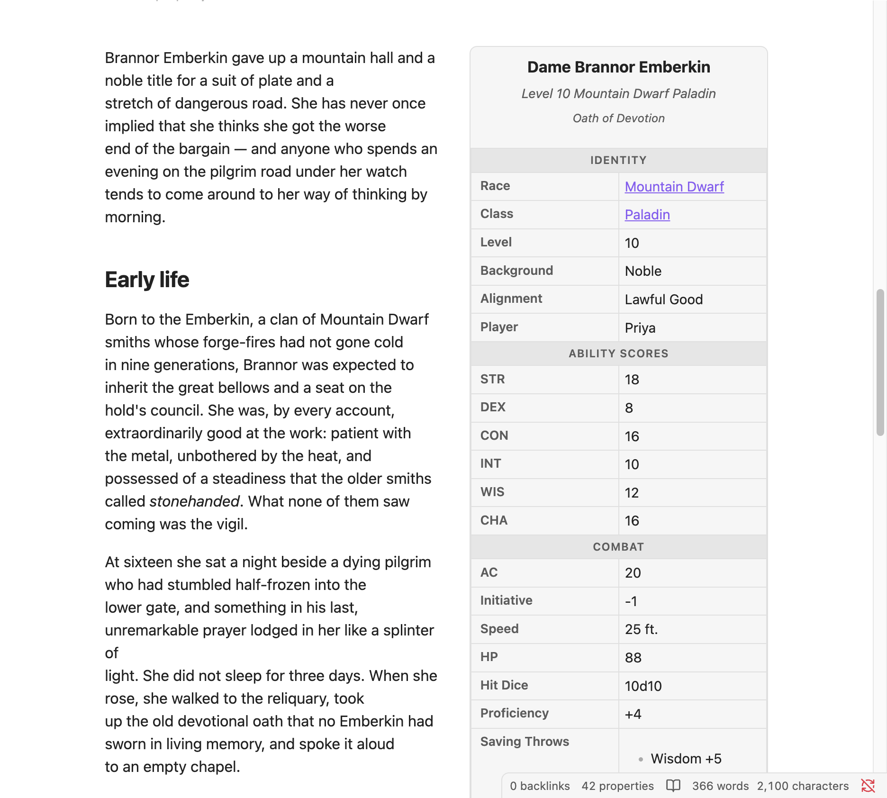
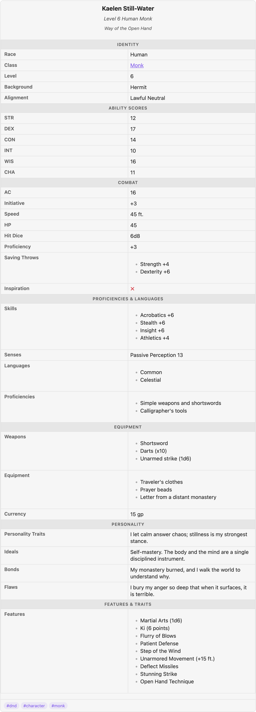

# Getting started

Advanced Infobox turns a note's ordinary frontmatter into a wiki-style infobox. You write
properties the normal way (in the Properties panel, or as YAML); the plugin renders them as
a floating card. Nothing is duplicated — the box is only a view of the data you already
have.



*Reading view with default settings — the box floats right and the prose wraps around it, Wikipedia-style.*

## Install

Advanced Infobox is a personal-use plugin distributed through **BRAT**, not the community
store. See the [main README](../README.md#install-brat) for the three-step BRAT install.
Once it's enabled in **Settings → Community plugins**, you're ready.

## Your first infobox

1. Give a note some ordinary properties:

   ```yaml
   ---
   title: Brynna Emberforge
   subtitle: Mountain Dwarf Paladin
   race: "[[Mountain Dwarf]]"
   class: "[[Paladin]]"
   level: 10
   armor_class: 20
   inspiration: true
   weapons:
     - Warhammer +1
     - Handaxe
   ---
   ```

2. Drop an anchor block anywhere in the body:

   ````markdown
   ```infobox
   ```
   ````

That's it. The empty block renders the note's frontmatter using your global
[settings](settings.md). Keys are auto-prettified (`armor_class` → "Armor Class"), wikilinks
are clickable, and numbers, dates, checkboxes, and lists all render type-aware — see the
[data model](data-model.md) for the full list.

> Wikilinks in properties **must be quoted** to be valid YAML: `race: "[[Mountain Dwarf]]"`.

## The two views

Obsidian has two editing surfaces, and the infobox adapts to each.

**Reading view** renders a true float: the body text wraps around the box like a wiki
article (the screenshot above). Placement (right / left / full width) is a
[setting](settings.md), overridable per note with a [block option](block-options.md).

**Live Preview** is a CodeMirror editor, and editor lines cannot wrap around a block
widget — so Live Preview renders a clean, non-wrapping card instead:



*Live Preview shows a non-wrapping card (full width by default; "follow placement" is an option).*

This isn't a missing feature — it's an architectural property of every editor of this kind.
You can optionally add a collapse toggle to the Live Preview card to fold it away while
writing.

## Editing in place

Turn on **Edit properties in infobox** in settings and the box becomes lightly interactive:
click a checkbox to flip it, type into a field (Enter or click-away commits, Escape
cancels), or add and remove list items. Every edit is written straight back to the note's
frontmatter through Obsidian's own API — the data stays the source of truth. It's off by
default.

## Next steps

- **[Data model](data-model.md)** — what counts as a field, and how each value type renders.
- **[Templates](templates.md)** — stop repeating layout: define it once, reuse it everywhere.
- **[TTRPG character sheets](ttrpg-example.md)** — a full worked example you can open in the [`test-vault`](../test-vault).
