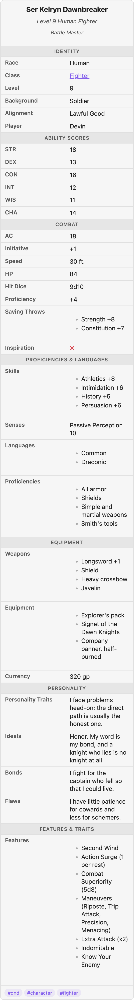

# Templates

A template defines a layout — labels, field order, and wiki-style sections — **once**, so
every note of the same kind renders consistently. A note opts in with a single flat
property; change the template and every note using it updates live.

## A template is just a note

Templates are ordinary markdown notes in your template folder (default `Templates/Infobox`,
[configurable](settings.md#templates)). **The note's name is its id.** A data note opts in
with the template property (default `infobox`):

```yaml
infobox: dnd
```

Here is the bundled `dnd` template (create it with the *Create sample infobox templates*
command, or find it at [`test-vault/Templates/Infobox/dnd.md`](../test-vault/Templates/Infobox/dnd.md)):

````markdown
---
race: Race
class: Class
level: Level
alignment: Alignment
background: Background
player: Player
---

## Identity
- race
- class
- level
- background
- alignment
- experience: XP
- player

## Ability Scores
- strength: STR
- dexterity: DEX
- constitution: CON
- intelligence: INT
- wisdom: WIS
- charisma: CHA

## Combat
- armor_class: AC
- initiative
- speed
- hit_points: HP
- ...

## Spellcasting
- spellcasting_ability: Spellcasting Ability
- spell_save_dc: Spell Save DC
- ...
````

## Frontmatter: labels and order

The template's **frontmatter maps keys to labels**, and its **key order is the display
order** when the body defines no sections. `race: Race` means "show the `race` property,
labelled Race." (Reserved key: `unlisted`, below.)

## Body: sections and label overrides

Headings in the body become **section headers** — full-width rows that group the fields
beneath them. Top-level list items name the keys:

- `- level` — show `level` under this section (label auto-prettified or inherited).
- `- armor_class: AC` — show `armor_class` here **and** label it "AC".

Prose is ignored, so a template can document itself. The order of sections and of keys
within them is the display order.

## Sections that hide themselves

This is the feature that makes one template serve very different notes. **A section whose
keys are all absent from a note renders nothing**, and any single missing key is simply
skipped. So the `dnd` template's *Spellcasting* section appears for a wizard and vanishes
for a fighter — automatically, with no per-note configuration:

| Nissa (Wizard) — has spellcasting keys | Ser Kelryn (Fighter) — has none |
| :---: | :---: |
|  |  |

Both notes say `infobox: dnd`. The fighter's card goes straight from *Proficiencies &
Languages* to *Equipment* because he has no `spell_save_dc`, `cantrips`, and so on — the
whole section quietly drops out.

## Hiding the leftovers

By default, any property a template doesn't name still appears, in a trailing unlabeled
group (so you never lose sight of data). Put `unlisted: hide` in the template frontmatter
(or a [block](block-options.md)) to drop unnamed properties instead, for a strictly curated
sheet.

## Precedence

When several sources define structure, the most specific wins:

```
block sections  >  template body sections  >  template frontmatter order  >  zero-config
```

See [block options](block-options.md#precedence) for overriding a template in a single note.

## Working with templates

Commands (from the palette):

- **Create sample infobox templates** — writes the starters (`person`, `place`,
  `organization`, `character`, and the TTRPG sheets `dnd`, `cyberpunk`, `wod`); only the
  missing ones.
- **Insert infobox with template** — fuzzy-pick a template and insert an anchor block that
  names it.
- **Add missing template properties to note** — scaffold the template's keys into the
  current note's frontmatter (via Obsidian's own API), ready to fill in.

## See also

- [TTRPG character sheets](ttrpg-example.md) — the `dnd` template driving a full 12-class roster.
- [Data model](data-model.md) — how the values under these labels are rendered.
